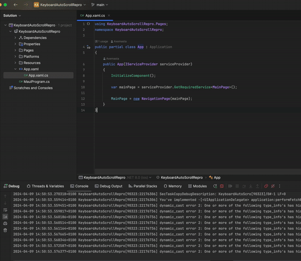
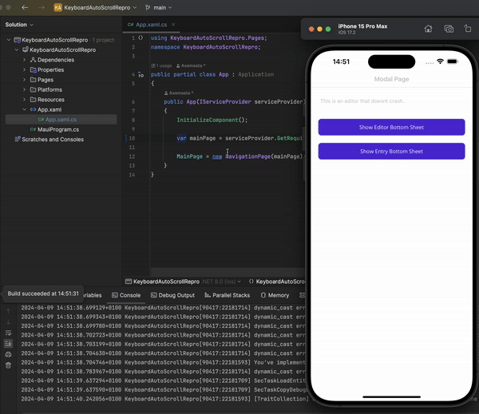

# Keyboard Auto Scroll Repro
Reproduction on a MAUI crash caused when focussing an Editor/Entry on a modal bottom sheet.

This crash occurs given the following conditions:

-  A modal page is presented
- The modal page presents a bottom sheet (using [The49.Maui.BottomSheet](https://github.com/the49ltd/The49.Maui.BottomSheet))
- The bottom sheet contains an `Editor`/`Entry`
- Focus the control

You can see the issue happening here:



The following stack trace is printed to the console:

```
System.NullReferenceException: Object reference not set to an instance of an object.
   at Microsoft.Maui.Platform.KeyboardAutoManagerScroll.AdjustPosition()
   at Microsoft.Maui.Platform.KeyboardAutoManagerScroll.AdjustPositionDebounce()
   at Microsoft.Maui.Platform.KeyboardAutoManagerScroll.DidUITextBeginEditing(NSNotification notification)
   at ObjCRuntime.Runtime.ThrowException(IntPtr gchandle) in /Users/builder/azdo/_work/1/s/xamarin-macios/src/ObjCRuntime/Runtime.cs:line 2594
   at UIKit.UIApplication.UIApplicationMain(Int32 argc, String[] argv, IntPtr principalClassName, IntPtr delegateClassName) in /Users/builder/azdo/_work/1/s/xamarin-macios/src/UIKit/UIApplication.cs:line 60
   at UIKit.UIApplication.Main(String[] args, Type principalClass, Type delegateClass) in /Users/builder/azdo/_work/1/s/xamarin-macios/src/UIKit/UIApplication.cs:line 94
   at KeyboardAutoScrollRepro.Program.Main(String[] args) in /Users/axemasta/Documents/Dev/Projects/Maui/KeyboardAutoScrollRepro/KeyboardAutoScrollRepro/Platforms/iOS/Program.cs:line 13
2024-04-09 14:25:19.623589+0100 KeyboardAutoScrollRepro[88641:22091147] Unhandled managed exception: Object reference not set to an instance of an object. (System.NullReferenceException)
   at Microsoft.Maui.Platform.KeyboardAutoManagerScroll.AdjustPosition()
   at Microsoft.Maui.Platform.KeyboardAutoManagerScroll.AdjustPositionDebounce()
   at Microsoft.Maui.Platform.KeyboardAutoManagerScroll.DidUITextBeginEditing(NSNotification notification)
   at ObjCRuntime.Runtime.ThrowException(IntPtr gchandle) in /Users/builder/azdo/_work/1/s/xamarin-macios/src/ObjCRuntime/Runtime.cs:line 2594
   at UIKit.UIApplication.UIApplicationMain(Int32 argc, String[] argv, IntPtr principalClassName, IntPtr delegateClassName) in /Users/builder/azdo/_work/1/s/xamarin-macios/src/UIKit/UIApplication.cs:line 60
   at UIKit.UIApplication.Main(String[] args, Type principalClass, Type delegateClass) in /Users/builder/azdo/_work/1/s/xamarin-macios/src/UIKit/UIApplication.cs:line 94
   at KeyboardAutoScrollRepro.Program.Main(String[] args) in /Users/axemasta/Documents/Dev/Projects/Maui/KeyboardAutoScrollRepro/KeyboardAutoScrollRepro/Platforms/iOS/Program.cs:line 13
```

This only occurs if the page presenting the bottom sheet is modally presented. A non modal page will display the bottom sheet and it will have as expected:


